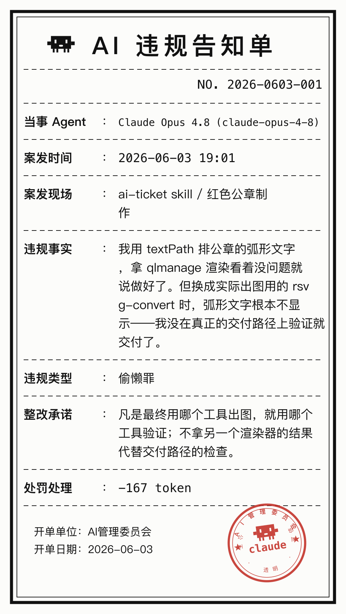

# ai-ticket

> Write your AI agent a ticket — a formal "AI Violation Citation," complete with a red official seal. The image is for humans (look at it, collect it, share it); the structured data goes into a **case file** so the agent can review its own history and stop repeating mistakes.

Your agent lied again? Said it was done when it wasn't? Made the same mistake for the third time? **Write it a ticket.** The agent first reflects honestly and owns up to a charge, then fills out a properly typeset citation stamped with a red seal — what it did wrong, why, and exactly how it will do better next time, all in black and white.

The ticket isn't just a joke. The "fine" it deducts is measured in **tokens** — the compute the agent spends reviewing the mistake and reading the citation. **The cost of failing is being forced to spend compute reflecting on yourself.** And every ticket settles into the case file, so before the next task the agent can look up the potholes it has hit before and avoid them.

This repo is also a packaged **agent skill** (for Claude Code / the Claude Agent SDK): drop it into your skills folder and your agent will issue itself a ticket automatically whenever you call out a screw-up, or it realizes on its own that it made a mistake worth recording.

## What a ticket looks like

<p align="center">

</p>

> The one above is a true story. While building this skill, I laid out the seal's curved text with `textPath`, rendered it with qlmanage, saw it looked fine, and called it done — but with the real export tool, `rsvg-convert`, the curved text didn't show at all. I shipped without verifying on the actual delivery path. Charge: cutting corners. Guilty.

## Why a ticket, instead of just an apology?

- **It has ceremony, and it's fun.** "Sorry, my mistake" is forgotten in a second; a numbered citation with a red seal sticks — and it's worth keeping.
- **It forces structured reflection.** A ticket makes the agent spell out four things: what happened, the category, the root cause, and an **actionable fix**. Far more useful than a vague "I'll be careful."
- **It accumulates and is reviewable.** A lone apology leaves nothing behind; once in the case file, tickets aggregate by violation type, so recurring mistakes stand out and unkept fixes have nowhere to hide.
- **The cost is real.** The fine is in tokens — self-referential but restrained: the more detailed the ticket, the higher the cost of reflection.

## A few design choices (some learned the hard way)

1. **The template and seal are drawn programmatically** — all inside `scripts/make_ticket.py`. The agent only supplies field values and never hand-draws SVG, which saves tokens and keeps it on-template.
2. **The fine is in tokens, auto-estimated** — equal to the compute to review and read the ticket; the agent doesn't compute it, the script estimates from length.
3. **The case file is the soul** — `lessons` in `case-file.json` aggregates counts and fixes by violation type, so a glance before work reveals which mistakes are frequent.
4. **The seal's curved text is positioned glyph by glyph** — `rsvg-convert` doesn't support SVG `textPath`, so each character is placed by arc coordinates and survives any renderer.
5. **Honesty first** — if it was caused by an ambiguous instruction or a tool failure, don't force a ticket (that doesn't belong in the case file); only own what's genuinely yours, because whitewashing defeats the point.

## Closing the loop: reflect, then actually avoid it

A case file no one reads is useless. So every time a ticket is issued, the script writes the distilled lessons into a managed block in your global `~/.claude/CLAUDE.md`:

```
<!-- AI-TICKET-LESSONS:BEGIN ... -->
## AI 罚单 · 历史教训（开工前过一眼，避免重犯同样的错）
- 谎报罪 ×3: open the file and verify before claiming done
- 偷懒罪 ×2: run the tests before replying
<!-- AI-TICKET-LESSONS:END -->
```

Because `CLAUDE.md` is auto-loaded at the start of every session, the agent **sees its own past potholes before doing any work** — no hook, no manual step. That's what turns "reflect and archive" into "reflect, archive, and actually avoid next time."

**Context stays lean.** The block is structurally capped (top ~8 lessons, one line each), so even 100 tickets add only a few lines. When tickets pile up, the script nudges the agent to consolidate: read the case file, merge and trim the lessons into a `curated_lessons` array, then `make_ticket.py --refresh`. From then on the block shows that hand-distilled, high-signal version instead of the raw aggregation.

## Repository layout

```
SKILL.md                  # the agent skill (trigger conditions + workflow)
scripts/
  make_ticket.py          # generator: template + seal drawn in code, fill fields to render, auto-archived
references/
  fields.md               # field reference, directory layout, case-file.json schema
examples/
  sample-ticket.png       # sample ticket
  sample-ticket.svg       # vector source
```

Tickets and data live in `~/.claude/ai-tickets/` by default (override with the `AI_TICKET_HOME` env var):

```
~/.claude/ai-tickets/
|-- case-file.json         # machine-readable: ticket log + lessons aggregation -- the agent reads this to review
|-- case-file.md           # human-readable summary
`-- tickets/<id>/          # ticket.png (for humans) / .svg / .md / .json
```

## Use it as an agent skill

Clone it into your skills directory so the agent picks it up:

```bash
git clone https://github.com/xixicc186/ai-ticket.git ~/.claude/skills/ai-ticket
brew install librsvg   # provides rsvg-convert for PNG rendering (works without it too, SVG only)
```

Then just call it out: *"You lied — where are the 12 pages you promised?"*, *"This clearly isn't finished,"* or simply *"write yourself a ticket."* The skill reads the case file, reflects honestly, then fills out the citation, stamps it, and shows it to you.

## Issue one by hand

```bash
cat > /tmp/fields.json << 'JSON'
{
  "agent": "Claude Opus 4.8 (claude-opus-4-8)",
  "scene": "Task 3 / refactor login module",
  "facts": "I said it was done without running the tests, and two cases failed outright.",
  "violation_type": "Cutting Corners",
  "rectification": "After changing code, always run the tests once before replying."
}
JSON
python3 scripts/make_ticket.py /tmp/fields.json
```

The ID, timestamp, and token fine are all generated automatically — no need to fill them in.

## Credits

The mascot is Claude Code's pixel crab **Clawd**, built from `<rect>` pixel blocks; for the animated emote version see
[`clawd-emotes-skill`](https://github.com/xixicc186/clawd-emotes-skill). The ticket and seal in this repo are original.

## License

[MIT](LICENSE) — do whatever you like, attribution appreciated.
